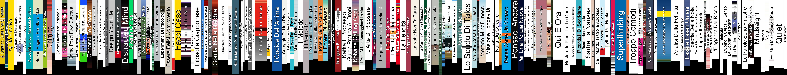

# Ebook to covers in library



```
import ebooklib
from ebooklib import epub
from PIL import Image # $ pip install pillow
from PIL import ImageFont
from PIL import ImageDraw 
import numpy
import glob
import os
from PyPDF2 import PdfReader
import random
import json
from tqdm import tqdm


import tempfile
from pdf2image import convert_from_path


def get_cover(filename):
	with tempfile.TemporaryDirectory() as path:
		images_from_path = convert_from_path(filename, output_folder=path, last_page=1, first_page =0)


	base_filename  =  os.path.splitext(os.path.basename(filename))[0] + '.jpg'	
	 
	for page in images_from_path:
		ret = os.path.join("pdf", base_filename)
		page.save(ret, 'JPEG')
		return ret


def diff(a,b):
	if a > b:
		return a - b
	else:
		return b -a


def type_text(image1, text, px, py, color, shadowcolor, rotate):
	imgw, imgh = image1.size
	for i in range(1,100):
		font = ImageFont.truetype('arial.ttf', i)
		bbox = font.getbbox(text)
		width, height = bbox[2] - bbox[0], bbox[3] - bbox[1]
		#print(str(width)+" > "+str(imgh)+" or "+str(height)+" > "+str(imgw))
		if width > imgh or height > imgw:
			font = ImageFont.truetype('arial.ttf', int(i * 0.8))
			bbox = font.getbbox(text)
			width, height = bbox[2] - bbox[0], bbox[3] - bbox[1]
			break


	image2 = Image.new('RGBA', (imgh, imgw), (0, 0, 0, 0))
	draw2 = ImageDraw.Draw(image2)
	imgw, imgh = image1.size


	x = int(diff(imgh,width)/2)
	y = int(diff(imgw,height)/2) - int(i / 6)


	#################SHADOW#################
	draw2.text((x-1, y-1), text, font=font, fill=shadowcolor)
	draw2.text((x+1, y-1), text, font=font, fill=shadowcolor)
	draw2.text((x-1, y+1), text, font=font, fill=shadowcolor)
	draw2.text((x+1, y+1), text, font=font, fill=shadowcolor)
	#################SHADOW#################


	draw2.text((x, y), text=text, font=font, fill=color)
	image2 = image2.rotate(rotate, expand=1)


	sx, sy = image2.size
	image1.paste(image2, (px, py, px + sx, py + sy), image2)
	return image1 


def get_concat_h(im1, im2):
	dst = Image.new('RGB', (im1.width + im2.width, im1.height))
	dst.paste(im1, (0, 0))
	dst.paste(im2, (im1.width, 0))
	return dst


def avg_col(ar):
	summ = 0
	cont = 0
	for a in ar:
		summ += (int(a[0][0]) + int(a[0][1]) + int(a[0][2]))/3
		cont += 1
	return summ / cont


def img_resize_from_h(img, new_height):
	width, height = img.size
	new_width = int((width / height) * new_height)
	img = img.resize((new_width, new_height), Image.Resampling.LANCZOS)
	return img


def is_close_to_white(image, threshold=240):
    """
    Verifica se l'immagine è prevalentemente bianca.
    :param image: L'immagine da controllare.
    :param threshold: Il valore sopra il quale i pixel sono considerati bianchi.
    :return: True se l'immagine è prevalentemente bianca, False altrimenti.
    """
    pixels = image.load()
    width, height = image.size
    for y in range(height):
        for x in range(width):
            r, g, b = pixels[x, y]
            if r < threshold or g < threshold or b < threshold:
                return False
    return True


def add_border_if_white(image_path):
    # Apri l'immagine
    image = Image.open(image_path)
    width, height = image.size
    
    # Modifica l'immagine se è prevalentemente bianca
    if is_close_to_white(image):
        # Crea una nuova immagine con le colonne nere aggiunte
        new_width = width + 2
        new_image = Image.new('RGB', (new_width, height), (255, 255, 255))
        new_pixels = new_image.load()
        
        # Copia i pixel dell'immagine originale nella nuova immagine
        original_pixels = image.load()
        for y in range(height):
            for x in range(width):
                new_pixels[x + 1, y] = original_pixels[x, y]
        
        # Aggiungi le colonne nere all'inizio e alla fine
        for y in range(height):
            new_pixels[0, y] = (0, 0, 0)  # Prima colonna nera
            new_pixels[new_width - 1, y] = (0, 0, 0)  # Ultima colonna nera
        
        return new_image
    else:
        # Restituisci l'immagine originale se non è prevalentemente bianca
        return image


blacklist = [' seo ', 'google', 'marketing', 'biohacking', 'trading', 'roberto re', 'marx', 'comunista', 'ipnosi', 'bitcoin', 'business', 'crowdfunding', 'farmaceutiche', '4 ore alla settimana', '12 regole per la vita', 'allucinazioni.epub', 'armi di persuasione di massa.pdf', 'bus 323 - emis killa.epub', 'drabkin', 'dsm', 'i ching.pdf', 'la cultura hip hop e la musica rap in italia - massimiliano vecchi.pdf', 'la mangiatoia - aa.vv_.epub', 'legge dell\'attrazione.pdf', 'menti sospettose (italian editi - rob brotherton', 'nienteansia', 'psiq', 'pubblicare libro', 'raising the bar the definitive guide to pull-up bar calisthenics', 'danilo bussa', 'mollo-tutto-e-cambio-vita', 'succede sempre qualcosa di meraviglioso', 'tecniche hacker - volume']


pdf_files = glob.glob("/media/mezzo/4345727E5C539F3E/Dropbox/Home/Scrivania/Mezzo/altro/Libri/*.pdf")
epub_files = glob.glob("/media/mezzo/4345727E5C539F3E/Dropbox/Home/Scrivania/Mezzo/altro/Libri/*.epub")
all_files = sorted(pdf_files + epub_files)


counter = 0
cm2px = 37.7952755906
result = Image.new('RGB', (1, int(24 * cm2px)))
for file in tqdm(all_files):
	skip = False
	for blackword in blacklist:
		if blackword in file.lower():
			skip = True
	if skip:
		continue


	txt_file = "pdf/" + os.path.basename(file).replace(".epub", ".txt").replace(".pdf", ".txt")
	book_file = txt_file.replace(".txt", ".jpg")
	if not os.path.isfile(txt_file):
		print(file)


		if ".epub" in file:
			pdf_file = "pdf/" + os.path.basename(file).replace("epub", "pdf")
			os.system('ebook-convert "'+file+'" '+'"'+pdf_file+'"')
		
			book = epub.read_epub(file)
			title = book.get_metadata('DC', 'title')[0][0]
		if ".pdf" in file:
			pdf_file = file
			title = file.replace(".pdf","")


		pdf = PdfReader(open(pdf_file,'rb'))
		pages = len(pdf.pages)
		cm = pages * 0.0072
		print(str(pages)+" pages "+str(cm)+" cm")


		#create image
		img = Image.open(get_cover(pdf_file))
		img = img_resize_from_h(img, random.randint(int(18 * cm2px), int(24 * cm2px)))
		pix = numpy.array(img)
		#get first column
		col = pix[:,:1,:]


		new_im = Image.fromarray(col)
		new_line = Image.fromarray(col)
		px = int(cm * cm2px)


		for i in range(px):
			new_im = get_concat_h(new_im, new_line)


		#get color text
		bg_col = avg_col(col)
		if bg_col > (255/2):
			txt_col = (0, 0, 0)
			shadowcolor = (255, 255, 255)
		else:
			txt_col = (255, 255, 255)
			shadowcolor = (0, 0, 0)


		#insert title text
		title = os.path.basename(title).replace("(Italian Edition)","").strip()
		title = title.split(":")[0].strip()
		title = title.split("(")[0].strip()


		f = open(txt_file,"w")
		f.write(json.dumps({"title": title, "txt_col": txt_col, "shadowcolor": shadowcolor}))
		f.close()


		new_im.save(book_file)
	else:
		f = open(txt_file,"r")
		data = json.loads(f.read())
		f.close()


		title = data["title"]
		txt_col = tuple(data["txt_col"])
		shadowcolor = tuple(data["shadowcolor"])


		#new_im = Image.open(book_file)
		new_im = add_border_if_white(book_file)


	new_im = type_text(new_im, title.title(), 0, 0, txt_col, shadowcolor, 90)


	#new_im.save('pillow_concat_h.jpg')


	result = get_concat_h(result, new_im)
	result.save('result.jpg')


	counter += 1


#elimina file nella cartella pdf
files = glob.glob('pdf/*.pdf')
for f in files:
	os.remove(f)
```